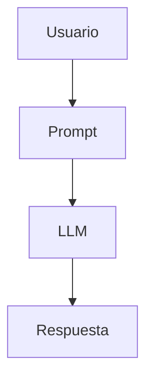
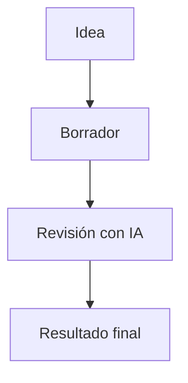

## Markdown y Mermaid: escribir y visualizar

Cuando trabajas con IA, muchas veces el resultado no empieza en Word ni en PowerPoint. Empieza como texto estructurado. Por eso conviene acostumbrarse a dos formatos muy útiles: **Markdown** para documentos y **Mermaid** para diagramas.

La idea no es memorizar reglas raras. La idea es escribir texto simple en Visual Studio Code y usar la vista previa para ver cómo queda.

Debes pensar en ello así:

* en el editor escribes
* en la vista previa ves el resultado
* puedes pasar de una vista a otra continuamente

Eso es más importante que aprender toda la sintaxis de memoria.

## Qué es Markdown

Markdown es una forma simple de escribir documentos con estructura. Sirve para títulos, listas, enlaces, tablas, bloques de código y más.

Por ejemplo, esto se escribe directamente así en el editor:

# Título principal

## Sección

Este es un párrafo normal.

* Primer punto
* Segundo punto

[Enlace a GitHub](https://github.com)

Si abres la vista previa, verás ese contenido ya formateado como documento.

## Qué es Mermaid

Mermaid sirve para escribir diagramas usando texto. En vez de dibujar cajas y flechas manualmente, describes el diagrama y la herramienta lo renderiza.

Por ejemplo, puedes escribir esto en un archivo Markdown:

Y la vista previa mostrará el diagrama.

Esto encaja muy bien con IA porque el diagrama también es texto. Puedes pedir a Copilot o a otro asistente que lo cree, lo corrija o lo reorganice.

## Cómo trabajar en Visual Studio Code

La forma correcta de aprender esto no es leer mucha teoría. Es escribir y mirar el resultado.

En Visual Studio Code:

* abre un archivo `.md`
* escribe el contenido en Markdown
* abre la vista previa
* compara lo que escribes con lo que se renderiza

Atajos útiles:

* `Ctrl + Shift + V` abre la vista previa de Markdown
* `Ctrl + K` y luego `V` abre la vista previa al lado

Lo ideal es tener el texto en una columna y la previsualización en la otra.

## Ejemplo simple de Markdown

Escribe esto tal cual:

# Mi documento

## Objetivo

Este documento explica una idea simple.

* Punto uno
* Punto dos
* Punto tres

## Enlace útil

[Ir a GitHub](https://github.com)

Luego abre la vista previa y observa cómo cambia.

## Ejemplo simple de Mermaid

Escribe esto dentro del archivo Markdown:

Después usa la vista previa para ver el diagrama.

## Extensiones recomendadas

Visual Studio Code ya soporta bastante bien Markdown. Para Mermaid, suele ser recomendable instalar una extensión que permita renderizar bien los diagramas o mejorar su visualización.

Busca en la pestaña de extensiones términos como:

* `Markdown Preview Mermaid Support`
* `Mermaid`
* `Markdown`

Al instalar una buena extensión, la experiencia de edición y visualización mejora bastante.

## Idea clave

No intentes imaginar mentalmente el resultado final a partir del texto. No hace falta.

El flujo correcto es:

1. escribir
2. previsualizar
3. corregir
4. volver a previsualizar

Ese ciclo es exactamente el que hace que Markdown y Mermaid sean tan útiles cuando trabajas con IA.

